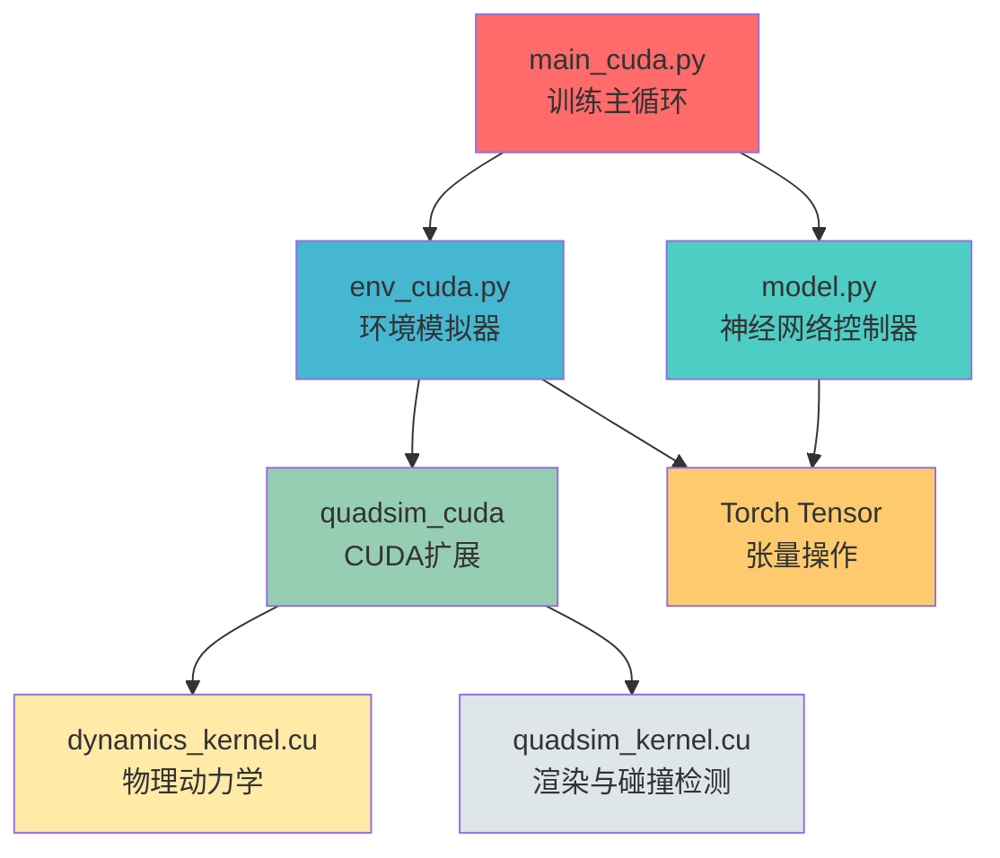

# DiffDrone 系统架构文档 / DiffDrone System Architecture Document

## 1. 项目简介 / Project Introduction

### 1.1 研究背景 / Research Background

DiffDrone 是一个基于**可微分物理 (Differentiable Physics)** 的四轴飞行器敏捷飞行训练系统，发表于 **Nature Machine Intelligence 2025**。该项目实现了端到端的视觉引导敏捷飞行学习，通过可微分的物理模拟器实现高效的策略训练。

DiffDrone is a **Differentiable Physics**-based quadrotor agile flight training system, published in **Nature Machine Intelligence 2025**. The project implements end-to-end vision-guided agile flight learning, enabling efficient policy training through a differentiable physics simulator.

### 1.2 核心技术 / Core Technologies

- **可微分物理模拟 (Differentiable Physics Simulation)**: 整个物理引擎支持端到端梯度反向传播
- **CUDA并行计算 (CUDA Parallel Computing)**: 高效的物理模拟和深度图像渲染
- **深度强化学习 (Deep Reinforcement Learning)**: CNN+GRU架构的神经网络控制器
- **多智能体协调 (Multi-Agent Coordination)**: 支持集群控制和动态碰撞检测

### 1.3 论文引用 / Paper Citation

```bibtex
@article{zhang2025learning,
  title={Learning vision-based agile flight via differentiable physics},
  author={Zhang, Yuang and Hu, Yu and Song, Yunlong and Zou, Danping and Lin, Weiyao},
  journal={Nature Machine Intelligence},
  pages={1--13},
  year={2025},
  publisher={Nature Publishing Group}
}
```

---

## 2. 系统架构 / System Architecture

### 2.1 层次结构图 / Layer Hierarchy

```
DiffDrone System
┌─────────────────────────────────────────────────────────────┐
│                    用户接口层 (User Interface)              │
│                  main_cuda.py (训练主循环)                   │
└────────────────────────┬────────────────────────────────────┘
                         │
┌────────────────────────▼────────────────────────────────────┐
│                   Python高层逻辑层                            │
│  ┌─────────────┐  ┌─────────────┐  ┌─────────────┐          │
│  │  model.py   │  │  env_cuda.py│  │   训练逻辑   │          │
│  │ 神经网络控制器 │  │ 环境模拟器   │  │  损失函数    │          │
│  │   + GRU     │  │  + 渲染引擎   │  │  优化器     │          │
│  └─────────────┘  └─────────────┘  └─────────────┘          │
└────────────────────────┬────────────────────────────────────┘
                         │ PyBind11接口
┌────────────────────────▼────────────────────────────────────┐
│                  CUDA加速层 (CUDA Layer)                      │
│  ┌─────────────┐  ┌─────────────┐  ┌─────────────┐          │
│  │quadsim.cpp  │  │  动力学内核   │  │  渲染内核    │          │
│  │  C++接口    │  │dynamics_    │  │quadsim_     │          │
│  │             │  │kernel.cu    │  │kernel.cu    │          │
│  └─────────────┘  └─────────────┘  └─────────────┘          │
└─────────────────────────────────────────────────────────────┘
```

### 2.2 模块依赖关系 / Module Dependencies



### 2.3 数据流图 / Data Flow

#### 前向传播流 / Forward Propagation Flow

```
┌─────────────────────────────────────────────────────────────────┐
│                    前向传播流程 (Forward Pass)                    │
└─────────────────────────────────────────────────────────────────┘

深度图像 [B,1,H,W]
    │
    ▼
┌─────────────────────────────────────────────────────────────────┐
│                  model.py - 神经网络控制器                         │
│  ┌──────────┐  ┌──────────┐  ┌──────────┐  ┌──────────┐        │
│  │   CNN    │→│   v_proj  │→│   GRU    │→│    FC    │        │
│  │  Stem    │  │  速度投影  │  │ 循环神经网络│  │  动作输出  │        │
│  └──────────┘  └──────────┘  └──────────┘  └──────────┘        │
└─────────────────────────────────────────────────────────────────┘
    │
    ▼
动作 [B,6] (加速度3维 + 速度3维)
    │
    ▼
┌─────────────────────────────────────────────────────────────────┐
│              env_cuda.py - 可微分物理模拟器                        │
│  ┌──────────┐  ┌──────────┐  ┌──────────┐                        │
│  │ 控制延迟   │→│  物理积分  │→│  状态更新  │                        │
│  │ 滤波器    │  │  欧拉积分  │  │  位置/速度  │                        │
│  └──────────┘  └──────────┘  └──────────┘                        │
└─────────────────────────────────────────────────────────────────┘
    │
    ▼
┌─────────────────────────────────────────────────────────────────┐
│            CUDA内核 - 物理动力学计算                                │
│  • 空气阻力计算 (Air Drag Calculation)                            │
│  • 姿态更新 (Attitude Update)                                     │
│  • 位置/速度积分 (Position/Velocity Integration)                  │
└─────────────────────────────────────────────────────────────────┘
    │
    ▼
新状态: 位置p, 速度v, 姿态R
    │
    ▼
┌─────────────────────────────────────────────────────────────────┐
│            CUDA内核 - 深度图像渲染                                 │
│  • 光线追踪 (Ray Casting)                                        │
│  • 障碍物相交测试 (Obstacle Intersection Test)                    │
│  • 深度值计算 (Depth Value Calculation)                          │
└─────────────────────────────────────────────────────────────────┘
    │
    ▼
新的深度图像 [B,H,W] → 用于下一个时间步
```

#### 反向传播流 / Backward Propagation Flow

```
┌─────────────────────────────────────────────────────────────────┐
│                    反向传播流程 (Backward Pass)                   │
└─────────────────────────────────────────────────────────────────┘

损失函数 L
    │
    ▼
┌─────────────────────────────────────────────────────────────────┐
│              损失计算 (Loss Computation)                           │
│  • 速度跟踪损失 loss_v                                           │
│  • 避障损失 loss_obj_avoidance                                   │
│  • 碰撞损失 loss_collide                                         │
│  • 平滑损失 loss_d_acc, loss_d_jerk                              │
└─────────────────────────────────────────────────────────────────┘
    │
    ▼ ∂L/∂状态
┌─────────────────────────────────────────────────────────────────┐
│            CUDA内核 - 物理反向传播                                │
│  • run_backward_cuda_kernel                                      │
│  • 计算关于位置、速度、加速度的梯度                                │
│  • 传播梯度到输入动作                                              │
└─────────────────────────────────────────────────────────────────┘
    │
    ▼ ∂L/∂动作
┌─────────────────────────────────────────────────────────────────┐
│                  model.py - 神经网络反向传播                       │
│  • 通过GRU反向传播                                                │
│  • 通过CNN反向传播                                                │
│  • 更新网络参数                                                    │
└─────────────────────────────────────────────────────────────────┘
    │
    ▼ ∂L/∂参数
┌─────────────────────────────────────────────────────────────────┐
│                  优化器更新 (Optimizer Update)                    │
│  • AdamW梯度下降                                                  │
│  • 余弦退火学习率调度                                              │
└─────────────────────────────────────────────────────────────────┘
```

---

## 3. 核心算法 / Core Algorithms

### 3.1 可微分物理模拟 / Differentiable Physics Simulation

#### 3.1.1 核心思想 / Core Concept

传统的强化学习通常使用黑盒模拟器，难以进行梯度反向传播。DiffDrone实现了**完全可微分的物理引擎**，使得梯度可以从最终损失直接传播到网络参数，实现端到端训练。

Traditional RL typically uses black-box simulators, making gradient backpropagation difficult. DiffDrone implements a **fully differentiable physics engine**, allowing gradients to propagate directly from the final loss to network parameters for end-to-end training.

#### 3.1.2 物理模型 / Physics Model

**运动方程 / Equations of Motion:**

$$ \mathbf{a}_{next} = \mathbf{a}_{filtered} + \mathbf{d}_g - \mathbf{F}_{drag} $$

$$ \mathbf{p}_{next} = \mathbf{p} \cdot \alpha^{dt} + \mathbf{v} \cdot dt + \frac{1}{2}\mathbf{a} \cdot dt^2 $$

$$ \mathbf{v}_{next} = \mathbf{v} \cdot \alpha^{dt} + \frac{\mathbf{a} + \mathbf{a}_{next}}{2} \cdot dt $$

其中 / Where:
- $\mathbf{a}_{filtered}$: 经过低通滤波的期望加速度 (filtered desired acceleration)
- $\mathbf{d}_g$: 扰动加速度 (disturbance acceleration)
- $\mathbf{F}_{drag}$: 空气阻力 (air drag force)
- $\alpha$: 梯度衰减系数 (gradient decay coefficient)
- $dt$: 时间步长 (time step)

#### 3.1.3 自动微分实现 / Automatic Differentiation Implementation

```python
class RunFunction(torch.autograd.Function):
    @staticmethod
    def forward(ctx, R, dg, z_drag_coef, drag_2, pitch_ctl_delay,
                act_pred, act, p, v, v_wind, a, grad_decay, ctl_dt, airmode):
        # 前向传播：调用CUDA内核计算物理状态
        # Forward pass: call CUDA kernel to compute physics state
        act_next, p_next, v_next, a_next = quadsim_cuda.run_forward(
            R, dg, z_drag_coef, drag_2, pitch_ctl_delay,
            act_pred, act, p, v, v_wind, a, ctl_dt, airmode)
        # 保存反向传播需要的上下文
        # Save context for backward pass
        ctx.save_for_backward(R, dg, z_drag_coef, drag_2, pitch_ctl_delay,
                              v, v_wind, act_next)
        ctx.grad_decay = grad_decay
        ctx.ctl_dt = ctl_dt
        return act_next, p_next, v_next, a_next

    @staticmethod
    def backward(ctx, d_act_next, d_p_next, d_v_next, d_a_next):
        # 反向传播：调用CUDA内核计算梯度
        # Backward pass: call CUDA kernel to compute gradients
        R, dg, z_drag_coef, drag_2, pitch_ctl_delay, v, v_wind, act_next = ctx.saved_tensors
        d_act_pred, d_act, d_p, d_v, d_a = quadsim_cuda.run_backward(
            R, dg, z_drag_coef, drag_2, pitch_ctl_delay,
            v, v_wind, act_next, d_act_next, d_p_next, d_v_next, d_a_next,
            ctx.grad_decay, ctx.ctl_dt)
        return None, None, None, None, None, d_act_pred, d_act, d_p, d_v, None, d_a, None, None, None
```

### 3.2 深度图像渲染 / Depth Image Rendering

#### 3.2.1 光线追踪算法 / Ray Casting Algorithm

渲染使用CUDA并行的**光线追踪 (Ray Casting)** 算法：

Rendering uses CUDA-parallelized **Ray Casting** algorithm:

```cuda
// 计算每个像素的光线方向 / Calculate ray direction for each pixel
const scalar_t dx = R[b][0][0] - fu * R[b][0][2] - fv * R[b][0][1];
const scalar_t dy = R[b][1][0] - fu * R[b][1][2] - fv * R[b][1][1];
const scalar_t dz = R[b][2][0] - fu * R[b][2][2] - fv * R[b][2][1];

// 从相机位置发射光线 / Emit ray from camera position
const scalar_t ox = pos[b][0];
const scalar_t oy = pos[b][1];
const scalar_t oz = pos[b][2];

// 计算光线与障碍物的最近交点 / Calculate closest intersection with obstacles
scalar_t min_dist = 100;
for (每个障碍物 obstacle) {
    // 射线-球体/圆柱体/长方体相交测试
    // Ray-sphere/cylinder/box intersection test
    scalar_t t = 计算交点距离(calculate intersection distance);
    if (t > 0) min_dist = min(min_dist, t);
}
canvas[b][u][v] = min_dist;  // 保存深度值 / Save depth value
```

#### 3.2.2 支持的几何体 / Supported Geometries

1. **球体 (Sphere)**: 适用于球形障碍物
2. **圆柱体 (Cylinder)**: 适用于垂直和水平圆柱障碍物
3. **长方体 (Box)**: 适用于长方体障碍物
4. **其他四轴飞行器 (Other Quadrotors)**: 用于多智能体碰撞检测

### 3.3 神经网络控制器 / Neural Network Controller

#### 3.3.1 网络架构 / Network Architecture

```
输入: 深度图像 [B,1,64,48] + 状态向量 [B,10]
    │
    ├─► CNN Stem (卷积特征提取)
    │   Conv2d(1→32, 2×2, stride=2) → [B,32,32,24]
    │   LeakyReLU(0.05)
    │   Conv2d(32→64, 3×3) → [B,64,30,22]
    │   LeakyReLU(0.05)
    │   Conv2d(64→128, 3×3) → [B,128,28,20]
    │   LeakyReLU(0.05)
    │   Flatten + Linear → [B,192]
    │
    ├─► 状态投影 v_proj
    │   Linear(dim_obs→192) → [B,192]
    │
    ├─► 特征融合
    │   img_feat + v_proj → [B,192]
    │   LeakyReLU(0.05)
    │
    ├─► GRU (循环神经网络)
    │   GRUCell(192→192) → [B,192]
    │
    └─► 动作输出 FC
        Linear(192→6) → [B,6] (加速度3维 + 速度3维)
```

#### 3.3.2 输入输出 / Input/Output

**输入 / Inputs:**
- 深度图像: `[B, 1, 64, 48]` (Batch, Channel, Height, Width)
- 状态向量: `[B, 10]`
  - 本地速度: `[3]`
  - 目标速度: `[3]`
  - 安全距离: `[1]`
  - 上向量: `[3]` (用于姿态对齐)
- 隐藏状态: `[B, 192]` (GRU记忆)

**输出 / Outputs:**
- 动作: `[B, 6]`
  - 加速度: `[3]` (ax, ay, az)
  - 速度预测: `[3]` (vx, vy, vz)
- 隐藏状态: `[B, 192]`

### 3.4 多智能体协调 / Multi-Agent Coordination

#### 3.4.1 智能体分组 / Agent Grouping

```python
# 每组4或8个智能体
# 4 or 8 agents per group
self.n_drones_per_group = random.choice([4, 8])

# 批处理索引分组
# Batch index grouping
batch_base = (b // self.n_drones_per_group) * self.n_drones_per_group
```

#### 3.4.2 碰撞检测 / Collision Detection

在渲染和最近点计算时，只检测同一组内的其他智能体：

During rendering and nearest point calculation, only detect other agents in the same group:

```python
# 只检测同组智能体 / Only detect agents in same group
for (int i = batch_base; i < batch_base + n_drones_per_group; i++) {
    if (i == b || i >= B) continue;
    // 计算与智能体i的碰撞 / Calculate collision with agent i
    scalar_t r = 0.15;  // 智能体半径 / Agent radius
    // 球体碰撞检测 / Sphere collision detection
    scalar_t a = dx * dx + dy * dy + 4 * dz * dz;
    scalar_t b = 2 * (dx * (ox - cx) + dy * (oy - cy) + 4 * dz * (oz - cz));
    scalar_t c = (ox - cx) * (ox - cx) + (oy - cy) * (oy - cy)
                 + 4 * (oz - cz) * (oz - cz) - r * r;
    scalar_t d = b * b - 4 * a * c;
    if (d >= 0) {  // 碰撞发生 / Collision occurred
        min_dist = min(min_dist, r);
    }
}
```

---

## 4. 实现细节 / Implementation Details

### 4.1 CUDA并行优化 / CUDA Parallel Optimization

#### 4.1.1 线程组织 / Thread Organization

```cuda
// 每个线程处理一个像素 / One thread per pixel
const int threads = 1024;  // 每个块的线程数 / Threads per block
const dim3 blocks((state_size + threads - 1) / threads);

// 在内核中 / Inside kernel
const int idx = blockIdx.x * blockDim.x + threadIdx.x;
const int B = canvas.size(0);  // 批大小 / Batch size
const int H = canvas.size(1);  // 高度 / Height
const int W = canvas.size(2);  // 宽度 / Width

if (idx >= B * H * W) return;  // 边界检查 / Boundary check

const int b = idx / (H * W);  // 批索引 / Batch index
const int u = (idx % (H * W)) / W;  // 高度索引 / Height index
const int v = idx % W;  // 宽度索引 / Width index
```

#### 4.1.2 内存访问优化 / Memory Access Optimization

- 使用**连续内存 (Contiguous Memory)** 确保高效的内存访问
- 使用`torch::PackedTensorAccessor`进行类型安全的张量访问
- 避免线程分歧 (Thread Divergence)

**使用连续内存 / Use Contiguous Memory:**
```python
# 在Python中确保张量连续 / Ensure tensors contiguous in Python
self.p = self.p.contiguous()
self.v = self.v.contiguous()
self.R = self.R.contiguous()
```

**在CUDA中访问 / Access in CUDA:**
```cuda
// 使用PackedTensorAccessor确保类型安全和高效访问
// Use PackedTensorAccessor for type-safe and efficient access
torch::PackedTensorAccessor<scalar_t,3,torch::RestrictPtrTraits,size_t> R
torch::PackedTensorAccessor<scalar_t,2,torch::RestrictPtrTraits,size_t> p
```

### 4.2 内存管理 / Memory Management

#### 4.2.1 梯度衰减 / Gradient Decay

为了防止梯度爆炸和加速收敛，使用梯度衰减：

To prevent gradient explosion and accelerate convergence, use gradient decay:

```python
class GDecay(torch.autograd.Function):
    @staticmethod
    def forward(ctx, x, alpha):
        ctx.alpha = alpha
        return x  # 前向不衰减 / No decay in forward

    @staticmethod
    def backward(ctx, grad_output):
        return grad_output * ctx.alpha, None  # 反向衰减 / Decay in backward
```

**数学原理 / Mathematical Principle:**

$$ \frac{\partial L}{\partial x_t} = \frac{\partial L}{\partial x_T} \cdot \alpha^{T-t} $$

其中 $\alpha \in (0, 1)$ 是衰减系数。

Where $\alpha \in (0, 1)$ is the decay coefficient.

#### 4.2.2 批处理 / Batching

所有计算都在批维度上并行，充分利用GPU：

All computations are parallelized across the batch dimension, fully utilizing the GPU:

```python
# 批大小 / Batch size
batch_size = 64  # 单智能体 / Single agent
batch_size = 256  # 多智能体 / Multi-agent

# 所有操作都是批处理 / All operations are batched
depth = env.render(ctl_dt)  # [batch_size, height, width]
act, _, h = model(x, state, h)  # [batch_size, action_dim]
```

### 4.3 自动微分机制 / Automatic Differentiation Mechanism

#### 4.3.1 自定义自动微分函数 / Custom Autograd Functions

DiffDrone定义了多个自定义自动微分函数来实现复杂的物理计算：

DiffDrone defines multiple custom autograd functions to implement complex physics calculations:

```python
# 1. GDecay: 梯度衰减函数 / GDecay: Gradient decay function
class GDecay(torch.autograd.Function):
    # ...

# 2. RunFunction: 物理模拟函数 / RunFunction: Physics simulation function
class RunFunction(torch.autograd.Function):
    # ...

# 3. CUDA内核扩展 / CUDA kernel extensions
import quadsim_cuda  # 导入编译的CUDA扩展 / Import compiled CUDA extension
```

#### 4.3.2 梯度传播路径 / Gradient Propagation Path

```
损失 Loss
  │
  ├─► ∂L/∂位置 → 物理内核反向传播 → ∂L/∂动作
  │                 │
  │                 └─► ∂L/∂神经网络参数
  │
  ├─► ∂L/∂速度 → 物理内核反向传播 → ∂L/∂动作 → ∂L/∂参数
  │
  └─► ∂L/∂碰撞距离 → 渲染内核反向传播 → ∂L/∂位置 → ...
```

### 4.4 实时性能 / Real-time Performance

#### 4.4.1 性能指标 / Performance Metrics

- **渲染速度**: 每帧约0.5-1ms (CUDA加速)
- **物理模拟**: 每帧约0.1-0.2ms (CUDA内核)
- **神经网络推理**: 每帧约0.5-1ms (CNN+GRU)
- **总延迟**: <3ms 每帧 (满足实时要求)

#### 4.4.2 优化技术 / Optimization Techniques

1. **CUDA并行化**: 所有像素级和智能体级计算并行化
2. **内存池化**: 预分配张量，避免动态内存分配
3. **混合精度**: 使用float32平衡精度和速度
4. **批处理**: 大批尺寸提高GPU利用率

---

## 5. 文件结构 / File Structure

```
DiffDrone/
├── README.md                          # 项目说明 / Project description
├── model.py                           # 神经网络控制器 / Neural network controller
├── env_cuda.py                        # 环境模拟器 / Environment simulator
├── main_cuda.py                       # 训练主循环 / Training main loop
├── configs/                           # 配置文件 / Configuration files
│   ├── single_agent.args              # 单智能体配置 / Single agent config
│   └── multi_agent.args               # 多智能体配置 / Multi-agent config
├── src/                              # CUDA扩展源码 / CUDA extension source
│   ├── quadsim.cpp                    # C++/PyTorch接口 / C++/PyTorch interface
│   ├── quadsim_kernel.cu              # 渲染内核 / Rendering kernel
│   ├── dynamics_kernel.cu             # 动力学内核 / Dynamics kernel
│   ├── setup.py                      # 编译脚本 / Build script
│   └── test.py                       # 测试脚本 / Test script
├── gifs/                             # 演示GIF / Demo GIFs
│   ├── 20ms.gif
│   ├── fpv_dense.gif
│   ├── swap_position.gif
│   └── main_task.gif
└── .opencode/                         # 计划和文档 / Plans and docs
    └── plan/                          # 工作计划 / Work plans
        └── PROJECT_ANNOTATION_PLAN.md
```

---

## 6. 总结 / Summary

DiffDrone是一个高度优化的端到端四轴飞行器训练系统，核心创新点包括：

DiffDrone is a highly optimized end-to-end quadrotor training system with key innovations:

1. **完全可微分的物理引擎**: 支持端到端梯度反传
2. **高效CUDA并行计算**: 深度图像渲染和物理模拟加速
3. **多智能体训练框架**: 支持集群控制和动态碰撞检测
4. **真实的物理建模**: 包含空气阻力、控制延迟等真实物理效果

通过这些创新，DiffDrone实现了高效的视觉引导敏捷飞行学习。

Through these innovations, DiffDrone achieves efficient vision-guided agile flight learning.
